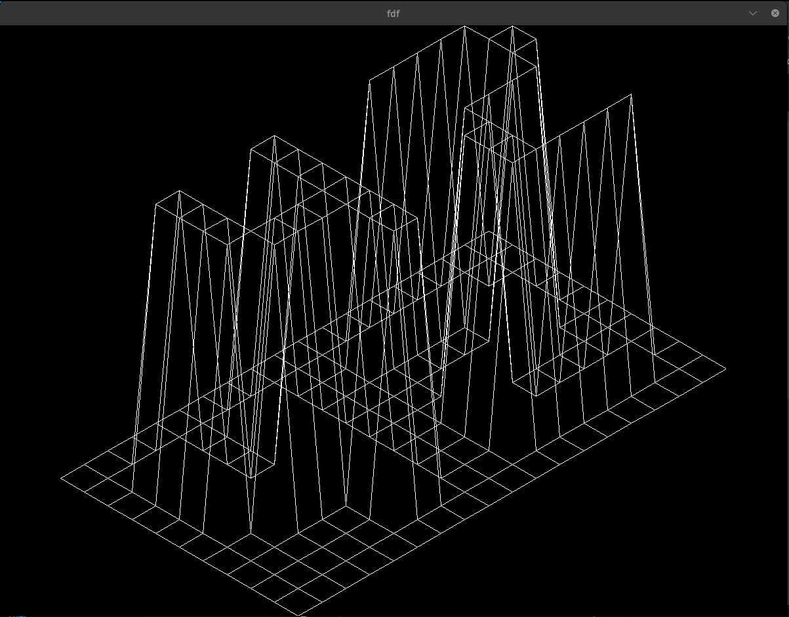

# About the FdF project

## Summary
This project aims to deepen your understanding of graphics programming and 3D modeling, using the MiniLibX library. 
- **Allowed external functions**: `open`, `close`, `read`, `write`, `malloc`, `free`, `perror`, `strerror`, `exit`, all functions of the math library, all functions of the MiniLibX


## Useful stuff
- [Introduction to the MiniLibX](https://youtu.be/bYS93r6U0zg?si=6EN12BMOm0uo6OdE)
- [GitHub repo for MiniLibX](https://github.com/42Paris/minilibx-linux)
- [Documentation for the MiniLibX](https://harm-smits.github.io/42docs)

## Mandatory Part
After running `make` your program should be executed as `./fdf map.fdf` and it should displays a 3D wireframe model in an isometric projection.

For example if this is the map:

```
0  0  0  0  0  0  0  0  0  0  0  0  0  0  0  0  0  0  0
0  0  0  0  0  0  0  0  0  0  0  0  0  0  0  0  0  0  0
0  0 10 10  0  0 10 10  0  0  0 10 10 10 10 10  0  0  0
0  0 10 10  0  0 10 10  0  0  0  0  0  0  0 10 10  0  0
0  0 10 10  0  0 10 10  0  0  0  0  0  0  0 10 10  0  0
0  0 10 10 10 10 10 10  0  0  0  0 10 10 10 10  0  0  0
0  0  0 10 10 10 10 10  0  0  0 10 10  0  0  0  0  0  0
0  0  0  0  0  0 10 10  0  0  0 10 10  0  0  0  0  0  0
0  0  0  0  0  0 10 10  0  0  0 10 10 10 10 10 10  0  0
0  0  0  0  0  0  0  0  0  0  0  0  0  0  0  0  0  0  0
0  0  0  0  0  0  0  0  0  0  0  0  0  0  0  0  0  0  0
```

It should be displayed like this:


- The window should close by clicking on the `X` or by hitting the `ESC` button.
- Some maps ar containing colours, it is not neccesary to apply the colors, but you can.
- You should only display the image once all the pixels has been drawn.
- You can compare the images with the `fdf_linux` program.

## Bonus Part
- Additional projections (e.g., parallel or conic).
- Zoom in and out functionality.
- Model translation (moving the model within the window).
- Model rotation.
- Any other creative feature that adds value to the project.